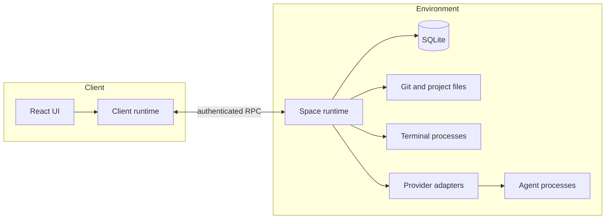

# Architecture

Space is a local-first application for coding agents and project tools. A client presents the interface. A runtime owns execution and durable state.

The boundary between the client and the runtime is the central design decision. It lets work survive a renderer reload or dropped connection. It also keeps project access on one machine and allows more than one client to control the same environment.

This document defines the target architecture. The current code is an early implementation of that design.

## Execution stays with the project

An environment is a Space runtime and the machine state that it can access. The environment owns:

- project checkouts and Git worktrees.
- agent provider processes and credentials.
- terminal processes.
- Git operations and checkpoints.
- durable projects, workspaces, threads, turns, and events.

A client sends commands and renders synchronized state. It does not run agents, terminals, Git commands, or file operations.

The same rule applies to the desktop application. Its renderer is a client of the bundled runtime even though both processes run on one machine. A future web or mobile client uses the same boundary.

## The system has three parts



The client contains the UI and one connection owner for each environment. Views read synchronized state from that connection owner.

The runtime is the authority for domain state and execution. It accepts commands, persists events, updates read models, runs background work, and publishes updates.

A provider adapter translates between the Space protocol and one agent provider. The rest of the system does not depend on provider-specific messages or process behavior.

## The runtime owns session lifetime

A terminal or agent session belongs to the runtime, not to a WebSocket connection. Closing a window or losing the network does not stop active work.

The runtime gives every session a durable identity. A client can reconnect, subscribe to the session, and continue from the last stored event. An explicit stop command or a runtime policy ends the session.

The current PTY implementation keeps the process and a bounded output buffer in runtime memory when a client disconnects. SQLite stores the session record and the receipt for its create command. A runtime restart ends the process and clears the output buffer. On startup, the runtime marks the session as exited with the `runtime-restart` reason, so a client cannot mistake the old session for a running process. The client can then create a new session with a new command ID.

## Domain terms have one meaning

- An **environment** is a runtime and the machine state that it owns.
- A **project** is a Git repository registered with one environment.
- A **worktree** is an isolated checkout used by a thread.
- A **workspace** is a saved canvas layout within a project.
- A **thread** is an agent conversation attached to a project and a worktree.
- A **turn** starts with one user request and ends when the agent stops processing that request.
- A **session** is one terminal or provider execution with a durable record.
- A **panel** is a canvas item such as a thread, terminal, diff, file view, or preview.

A workspace and a worktree are different objects. The workspace stores presentation and tool layout. The worktree stores project files for one thread.

A thread outlives its provider session. Space can stop a process and later resume the conversation when the provider supports it.

## Commands record intent before work starts

The runtime changes domain state through commands and events. A command describes intent. An event records an accepted change.

One command follows this path:

1. The runtime decodes and authorizes the command.
2. The domain handler validates the command against current state.
3. One SQLite transaction stores the new events, updated read models, and a command receipt.
4. The runtime acknowledges the command and publishes the committed updates.
5. A worker performs the provider, terminal, filesystem, or Git operation.
6. The worker reports the result through another command, which follows the same path.

An acknowledgement means that Space recorded the intent. It does not mean that the external operation has finished.

Workers run side effects only after the transaction commits. A provider crash or failed Git command therefore cannot leave stored state ahead of recorded intent.

In the target protocol, every mutation carries a stable command ID. If a client retries the same command after a disconnect, the runtime returns the existing receipt instead of repeating the operation. The current protocol implements receipts for `terminal.create`; the remaining terminal mutations do not have command IDs yet.

Not every streamed value belongs in the event log. Terminal bytes and partial assistant output use bounded streams. Space persists lifecycle changes, completed messages, approvals, tool results, and diffs.

## Read models drive the client

The event log records domain history. Read models provide the current shape needed by the UI, such as a thread list, a workspace layout, or a terminal status.

A subscription sends a snapshot followed by ordered updates. Each update has a cursor. The client stores state and its cursor together only after it applies the update.

Subscriptions are selective. A client requests only the workspace, thread, terminal, or diff that a mounted view needs. The runtime does not broadcast all environment events to every client.

After a reconnect, the client asks for updates after its last cursor. The runtime sends a new snapshot when it can no longer replay the missing range.

The client can display cached read models while offline. Cached data remains marked as stale and never replaces newer data received from the runtime.

## One connection owner handles recovery

Each client creates one connection owner for each environment. React views share that owner and do not open their own sockets or retry loops.

The connection owner tracks two separate conditions:

- transport state reports whether the RPC connection is reachable.
- synchronization state reports whether each read model is current.

An open socket does not prove that thread or workspace data is current. A failed subscription also does not mean that the transport is offline.

The connection owner retries transient transport failures with a limited backoff. Authentication failures wait for new credentials. Reconnection restores subscriptions, but it does not replay commands without a stable command ID.

## One protocol connects every client

`packages/protocol` defines the messages that cross the client and runtime boundary. Both sides decode untrusted input with Effect Schema.

The target transport is one authenticated Effect RPC WebSocket for each environment. Commands, queries, and subscriptions share that connection. HTTP remains limited to bootstrap operations that must work before an RPC session exists, such as health checks and pairing.

Socket authentication identifies the client. Each RPC method still checks whether that client can perform the requested operation.

Remote authentication uses scoped sessions. A long-lived pairing credential creates the session but does not travel on each WebSocket connection. The client exchanges it for a short-lived WebSocket ticket with only the required scopes.

Clients and runtimes can upgrade independently. During connection, the runtime advertises supported capabilities. The client checks those capabilities before it uses an optional operation.

Persisted events also require compatibility. A runtime update must decode events written by earlier releases or migrate them before normal startup.

## Provider adapters isolate agent differences

The runtime uses normalized commands and events for all providers. A provider adapter handles the provider-specific protocol and lifecycle.

A provider driver declares one integration type and its configuration schema. A provider instance represents one configured account and its live resources. Threads refer to a provider instance so that two accounts for the same provider do not share mutable state.

An adapter has these responsibilities:

- declare its provider kind and capabilities.
- start, resume, and stop a provider session.
- submit a turn.
- translate provider output into Space events.
- handle approval and permission requests.
- map provider failures to Space errors.

The orchestration code does not branch on provider names. If a provider cannot support an operation, its adapter rejects the command before Space changes project state.

Provider capabilities include conversation resume, conversation rollback, structured tool events, and approval handling. The UI derives available actions from those capabilities.

## Worktrees isolate concurrent threads

Each agent thread uses its own Git worktree by default. One thread cannot change files underneath another active thread.

The runtime performs all Git and filesystem operations. Clients receive file trees, diffs, and Git status through queries and subscriptions.

A checkpoint records the worktree state associated with a turn without adding a commit to the developer's branch. Hidden Git refs store checkpoint data.

A revert must coordinate the worktree and the provider conversation. If the provider cannot roll back the conversation, its adapter rejects the revert before the runtime changes files.

## Local and remote environments use the same model

The Electron main process starts the bundled runtime and gives the renderer its address and credential. The main process owns that child and stops it when the application quits.

A remote environment runs the same runtime near its project files and provider credentials. SSH, a private network, or a relay can change how the client reaches it. These routes do not create another execution model.

An environment keeps a stable ID when its address changes or its process restarts. Projects, threads, and sessions belong to that environment.

Only one runtime process can own an environment database at a time. A process-level directory lock rejects a second owner and removes a stale lock left by a crashed process. On Linux, the lock compares both the process ID and the process start time to detect a reused ID. Other operating systems only provide the process check, so a stale lock can survive in the rare case that the operating system reuses its process ID before the next runtime starts.

The local runtime listens on a loopback address by default. Remote access requires explicit pairing, authenticated requests, and an encrypted transport.

## Package boundaries follow ownership

The target repository layout keeps shared protocol and client state outside platform applications:

```text
apps/
  desktop/          Electron lifecycle and desktop UI
  runtime/          Domain logic, orchestration, providers, Git, PTYs, and storage
packages/
  client-runtime/   Connections, subscriptions, caches, and synchronized client state
  protocol/         RPC, command, event, error, and domain schemas
```

`apps/desktop` supplies Electron-specific lifecycle and credential storage. `packages/client-runtime` must not import Electron or browser UI code.

`apps/runtime` owns every operation that touches project files, Git, a terminal, or an agent provider. `packages/protocol` contains data contracts only and performs no I/O.

## Architectural constraints

New code must preserve these constraints:

- A client never becomes the authority for project or conversation state.
- A connection never owns the lifetime of a terminal or agent session.
- Provider-specific types never cross the adapter boundary.
- External I/O never runs inside the command transaction.
- High-volume terminal and model streams never become durable domain events.
- A remote route never changes which environment owns execution.
- Optional behavior depends on advertised capabilities, not version checks.
